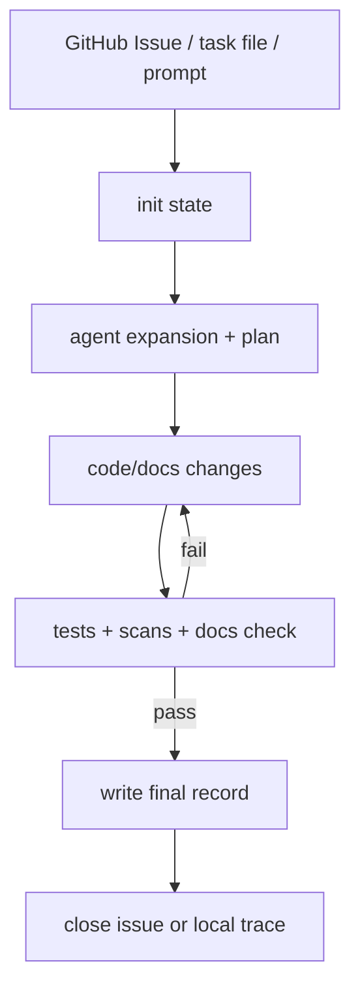

# Simple Workflow Skill Set Design

这是一套参考 Yorun 思想但更小的 workflow skill set 方案。目标不是重新做一个复杂 runtime，而是把 GitHub Issue 作为 trigger 和记录出口，用确定性的 CLI 脚本驱动 Agent 完成任务。

## 目标

- 从 GitHub Issue、任务文件或用户 prompt 启动开发任务。
- 每个任务都经过轻量 loop：触发、分析计划、执行、门禁检查、记录收口。
- Issue body 或本地 trace 是唯一主记录，避免任务正文和评论分裂。
- 支持小任务，不要求完整 Yorun 级别的事件溯源、权限裁剪、复杂审批协议。

## 最小模块

| 模块 | 职责 | 当前可复用 |
|------|------|------------|
| `workflow-trigger` | 识别 GitHub Issue、任务文件、用户 prompt，并创建 workflow state | `git-workflow/scripts/create_issue.py`、`local-workflow/scripts/orchestrate.py` |
| `workflow-plan` | 生成 Agent 扩展问题、假设、验收标准、短计划 | 新增轻量命令或由 Agent 手动写入 `--agent-expansion`/`--plan` |
| `workflow-execute` | 执行代码修改、文档修改、局部验证 | 当前由 coding agent 执行 |
| `workflow-gate` | 运行测试、secret scan、doc checker、dirty worktree 检查 | `doc_checker.py`、`scanning-for-secrets`、仓库测试命令 |
| `workflow-record` | 将最终记录写入 GitHub Issue body 或本地 trace | `close_issue.py`、`tracing.py` |

## 状态模型

```json
{
  "workflow_id": "github-42",
  "mode": "github",
  "phase": "init",
  "issue": 42,
  "repo": "owner/repo",
  "title": "Task title",
  "task": "Original task description",
  "agent_expansion": "",
  "plan": "",
  "execution": "",
  "checks": [],
  "result": "",
  "created_at": "2026-06-08T00:00:00Z"
}
```

`phase` 只需要五个值：`init`、`plan`、`execute`、`gate`、`finish`。

## 最小 CLI

```bash
# GitHub trigger: create Issue and state
workflow init github --title "Task title" --description "Task description"

# Plan: record expansion and plan
workflow plan --agent-expansion "assumptions + acceptance" --plan "short plan"

# Gate: run configured checks and write results to state
workflow gate --test "bun test" --secret-scan --docs

# Finish: update Issue body/local trace and close if GitHub mode
workflow finish --message "completion summary"
```

当前 `git-workflow` 已经覆盖 `init` 和 `finish`，并把 `plan`、`execution` 作为 `finish` 参数写入 Issue body。下一步可以把 `workflow plan` 和 `workflow gate` 单独脚本化，让 Agent 不需要手动拼参数。

## 简化后的 Loop



## 和 Yorun 的关系

- 借鉴：phase、gate、record、context packet 这些概念。
- 不照搬：不做复杂权限裁剪、事件溯源 runtime、多 agent 协议、长期 durable workflow。
- 当前优先：用 CLI 和 JSON state 固化流程，让 Codex、Claude Code、OpenCode、Trae、Kimi 都能执行。

## 实现任务

1. 将 `git-workflow` 和 `local-workflow` 的 state schema 对齐。
2. 新增 `workflow-plan` 脚本：读取 state，写入 `agent_expansion` 和 `plan`。
3. 新增 `workflow-gate` 脚本：按配置运行测试、secret scan、doc checker，并写入 `checks`。
4. 让 `finish` 默认读取 state 中的 plan/execution/checks，CLI 参数只作为覆盖。
5. 创建 `skills/devops/workflow-runtime/SKILL.md`，作为跨 GitHub/local 的总入口。

## 成熟度判断

先不做完整 Yorun runtime。只有当出现以下需求时，再升级到更重的 runtime：多人审批、跨天任务恢复、强权限边界、可追责事件链、复杂并发任务。当前阶段用轻量 CLI 足够稳定，也更容易被使用者上手。
