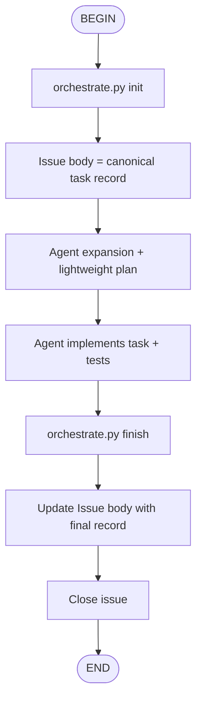

# Git Workflow Reference

## Workflow Overview



## Manual Steps

### 1. Create Issue

```bash
python3 .agents/skills/git-workflow/scripts/orchestrate.py init \
  --title "Task title" \
  --description "Task description" \
  --labels "task"
```

This creates a GitHub Issue and initializes its body as the canonical workflow record. It does not create a duplicate first comment.

### 2. Plan and Implement Task

Even small tasks should keep a lightweight loop:

- Expand the task into assumptions, open questions, and acceptance criteria.
- Write a short implementation plan.
- Edit code and docs.
- Run the smallest useful tests/checks.

### 3. Close Issue

```bash
python3 .agents/skills/git-workflow/scripts/orchestrate.py finish \
  --agent-expansion "Assumptions, clarified scope, acceptance criteria" \
  --plan "Plan summary" \
  --execution "Changed areas, tests, checks" \
  --message "Completion summary"
```

`finish` updates the Issue body and closes the Issue in one operation.

## Final Issue Body

```markdown
# Task

Original task description.

## Agent Expansion

Clarified scope, questions, assumptions, and acceptance criteria.

## Plan

Short task plan or loop summary.

## Execution

Changed areas, tests, checks, and generated documentation suggestions.

## Result

Completion summary.

## Metadata

- Title: Task title
- Created at: 2026-06-08T00:00:00Z
- Completed at: 2026-06-08T00:10:00Z
- Status: closed
```

## Git Hooks

### prepare-commit-msg

Auto-appends `Refs: #<issue>` to commit messages when branch name starts with issue number.

**Example**: branch `42-feature-login` -> commit message gets `Refs: #42`

### post-commit

Auto-comments on the GitHub Issue after each commit with commit hash, message, and branch. These comments are optional event logs; the canonical workflow record remains the Issue body.

## Kimi Hooks

### kimi-auto-issue.sh (PostToolUse)

Auto-creates a GitHub Issue when a `.md` file in `tasks/` directory is written.

### kimi-stop-update.sh (Stop)

Auto-comments on the active Issue when the Kimi session ends. This is an optional session event log, not the main workflow record.

## State File

`.git-workflow.state.json` tracks the active workflow:

```json
{
  "issue": 42,
  "repo": "owner/repo",
  "description": "Original task description",
  "title": "Task title",
  "created_at": "2026-06-08T00:00:00Z",
  "issue_body": "# Task\n\nOriginal task description..."
}
```
