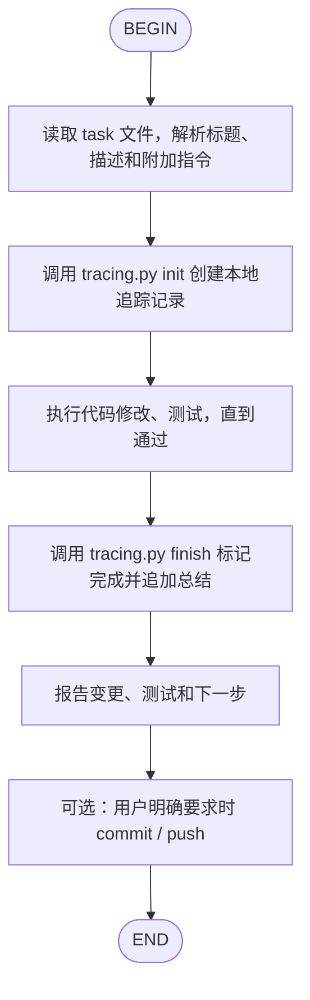

# Local Task Workflow

本地任务管理的工作流：通过本地文件系统追踪任务执行过程，无需 GitHub Issues。

## 使用方式

### 方式 A：普通对话模式（推荐）

直接对 AI 说：

> "请执行 `tasks/login-refactor.md`，要求使用 JWT 实现登录，并使用 Local Workflow。"

AI 读取本 Skill 后，应自动按以下步骤执行：
1. 读取 task 文件
2. 初始化本地追踪记录
3. 执行代码修改和测试
4. 更新追踪记录（标记完成）
5. 停下来报告结果；只有用户明确要求时才提交或推送代码

### 方式 B：编排器模式

使用 orchestrate.py 脚本管理整个工作流：

```bash
# 初始化：创建本地追踪记录
python3 .agents/skills/local-workflow/scripts/orchestrate.py init tasks/my-task.md

# AI 实现任务...

# 完成：更新追踪记录
python3 .agents/skills/local-workflow/scripts/orchestrate.py finish
```

## 自动化流程



### 节点说明

**READ**
- 读取用户指定的 task 文件（如 `tasks/xxx.md`）
- 第一行（去除 `# `）作为任务标题
- 全文作为任务描述
- 解析用户附加的实现指令

**TRACE_INIT**
- 运行：`python3 .agents/skills/local-workflow/scripts/tracing.py init --task ... --parsed "..."`
- 创建 `tasks/tracing/<task-name>.md` 记录文件
- 包含：原始任务内容、Agent 解析内容、开始时间、状态

**IMPLEMENT**
- 根据 task 内容和附加指令执行代码修改
- 运行相关测试，修复直到通过
- 如有需要，更新文档

**TRACE_FINISH**
- 运行：`python3 .agents/skills/local-workflow/scripts/tracing.py finish --task ... --summary "..."`
- 更新追踪记录状态为 completed
- 追加：完成时间、实现总结、修改的文件列表

**OPTIONAL_COMMIT**
- 默认不执行 `git commit` 或 `git push`
- 用户明确要求提交时，可运行 `finish --commit`
- 用户明确要求推送时，可运行 `finish --commit --push`
- 提交前先检查 `git status`、测试结果和 secret scan

## AI Agent Protocol 支持

Local Workflow 支持 **AI Agent Protocol**，自动捕获 AI Agent 的执行输出：

### 工作原理

1. **初始化时**设置环境变量：
   ```bash
   TASK_WORKFLOW_MODE=local
   TASK_CAPTURE_OUTPUT=true
   TASK_OUTPUT_FILE=.task-output.md
   ```

2. **AI Agent 执行**时写入结构化输出到 `.task-output.md`

3. **完成时**自动捕获并追加到 tracing 文件

### AI Agent 输出格式

AI Agent 应写入 `.task-output.md`：

```markdown
## Task Execution Summary

### Understanding
[AI Agent 对任务的理解]

### Actions Taken
1. [动作 1]
2. [动作 2]

### Files Modified
| File | Changes |
|------|---------|
| `path/to/file` | [描述] |

### Results
- **Status**: ✅ Completed
- **Tests**: [测试结果]
```

详见：AI Agent Protocol 输出格式（见上方示例）

## 与 GitHub Workflow 的区别

| 特性 | Local Workflow | GitHub Workflow |
|------|---------------|-----------------|
| 需要 GitHub | 否 | 是 |
| 创建 Issue | 否 | 是 |
| 追踪位置 | `tasks/tracing/*.md` | GitHub Issue + `tracing/*.md` |
| AI Agent 输出捕获 | ✅ 支持 | ✅ 支持 |
| 适用场景 | 本地开发、无网络、私有项目 | 团队协作、需要 GitHub 集成 |

## 脚本说明

所有脚本位于 `scripts/` 目录。

### 初始化追踪

```bash
python3 .agents/skills/local-workflow/scripts/tracing.py init \
  --task tasks/features/my-feature.md \
  --parsed "Agent解析后的任务内容"
```

| 参数 | 说明 |
|------|------|
| `--task` | Task 文件路径（必填） |
| `--parsed` | Agent 解析后的任务内容（可选） |

### 完成追踪

```bash
python3 .agents/skills/local-workflow/scripts/tracing.py finish \
  --task tasks/features/my-feature.md \
  --summary "实现总结：修改了 xxx.py，添加了 yyy 功能"
```

| 参数 | 说明 |
|------|------|
| `--task` | Task 文件路径（必填） |
| `--summary` | 实现总结（可选） |

### 查看追踪状态

```bash
# 查看所有本地追踪记录
python3 .agents/skills/local-workflow/scripts/tracing.py status

# 查看指定任务的追踪记录
python3 .agents/skills/local-workflow/scripts/tracing.py show --task tasks/features/my-feature.md
```

### 编排器

```bash
# 初始化工作流
python3 .agents/skills/local-workflow/scripts/orchestrate.py init tasks/my-task.md [附加指令]

# 查看状态
python3 .agents/skills/local-workflow/scripts/orchestrate.py status

# 完成工作流，只更新 tracing，不提交或推送
python3 .agents/skills/local-workflow/scripts/orchestrate.py finish

# 可选：完成并提交
python3 .agents/skills/local-workflow/scripts/orchestrate.py finish --commit

# 可选：完成、提交并推送
python3 .agents/skills/local-workflow/scripts/orchestrate.py finish --commit --push

# 中止工作流
python3 .agents/skills/local-workflow/scripts/orchestrate.py abort
```

## 追踪记录格式

追踪记录保存在 `tasks/tracing/` 目录下，以任务文件名命名：

```markdown
# Tracing: my-feature

## Task Entry (2026-04-06 10:00:00)

- **Task File**: `tasks/features/my-feature.md`
- **Task ID**: local-20260406-abc123
- **Started At**: 2026-04-06 10:00:00
- **Status**: completed
- **Completed At**: 2026-04-06 11:30:00

### Original Task Content

[原始任务内容]

### Agent Parsed Content

[Agent 解析的内容]

### Implementation Summary

- 修改了 src/auth.py
- 添加了 JWT 验证逻辑
```

## 完整命令示例

### 普通对话模式（最常用）

```bash
# 直接对 AI 说：
# "请执行 tasks/auth-refactor.md，要求使用 JWT 实现登录，使用 Local Workflow"
```

### 编排器模式

```bash
# Step 1: 初始化工作流
python3 .agents/skills/local-workflow/scripts/orchestrate.py init tasks/auth-refactor.md

# Step 2: AI 实现任务...

# Step 3: 完成
python3 .agents/skills/local-workflow/scripts/orchestrate.py finish
```

### 分步手动模式

```bash
# Step 1: 初始化追踪
python3 .agents/skills/local-workflow/scripts/tracing.py init \
  --task tasks/auth-refactor.md \
  --parsed "使用 JWT 实现登录功能"

# Step 2: AI 实现任务...

# Step 3: 完成追踪
python3 .agents/skills/local-workflow/scripts/tracing.py finish \
  --task tasks/auth-refactor.md \
  --summary "重构了 auth/service.go，添加了 JWT 刷新逻辑"

# Step 4: 人工检查后按需提交
git status --short
# run tests and secret scan first
git add <changed-files>
git commit -m "Complete auth refactor with JWT implementation"
# git push only when requested
```

## 安装

Prefer installing with `skill-spark`:

```bash
./dist/skill-spark add skills/devops --skill local-workflow --agent codex claude-code opencode trae kimi --yes
```

The bundled install scripts are legacy fallbacks for environments that do not use `skill-spark`:

```bash
./scripts/install.sh --system
.\scripts\install.ps1 -System
```
