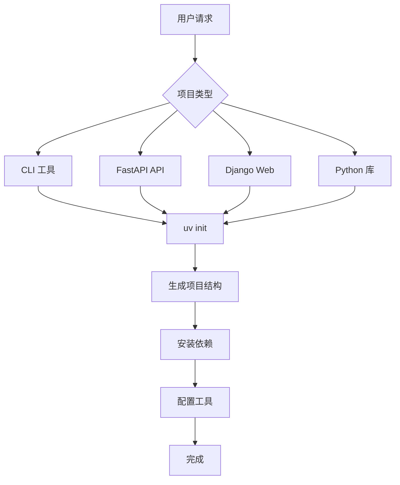

# Python UV Environment Skill

> Create modern Python projects with uv — fast, reliable, and reproducible.

## 用途

使用 uv 创建和管理 Python 项目环境：

- **快速初始化**: 一键创建项目结构
- **依赖管理**: 使用 uv 管理依赖，比 pip 快 10-100x
- **项目模板**: 支持 CLI、FastAPI、Django、Library 等类型
- **工具集成**: 自动配置 ruff、mypy、pytest 等工具

## 工作流程



## 使用方法

### 基本用法

```bash
# 创建 CLI 项目
uv init my-cli --lib
cd my-cli

# 创建应用项目
uv init my-app
cd my-app

# 添加依赖
uv add requests click rich

# 运行脚本
uv run python main.py
```

### 项目类型

#### 1. CLI 工具

```bash
# 创建 CLI 项目
uv init my-cli-tool --lib
cd my-cli-tool

# 添加 CLI 依赖
uv add click rich typer

# 项目结构
my-cli-tool/
├── pyproject.toml
├── README.md
├── src/
│   └── my_cli_tool/
│       ├── __init__.py
│       ├── cli.py
│       └── utils.py
└── tests/
    └── test_cli.py
```

#### 2. FastAPI API

```bash
# 创建 FastAPI 项目
uv init my-api
cd my-api

# 添加 FastAPI 依赖
uv add fastapi uvicorn[standard] pydantic

# 项目结构
my-api/
├── pyproject.toml
├── README.md
├── src/
│   └── my_api/
│       ├── __init__.py
│       ├── main.py
│       ├── api/
│       │   ├── __init__.py
│       │   ├── deps.py
│       │   └── v1/
│       │       ├── __init__.py
│       │       ├── router.py
│       │       └── endpoints/
│       │           ├── __init__.py
│       │           ├── health.py
│       │           └── users.py
│       ├── core/
│       │   ├── __init__.py
│       │   ├── config.py
│       │   └── security.py
│       ├── models/
│       │   ├── __init__.py
│       │   └── user.py
│       └── schemas/
│           ├── __init__.py
│           └── user.py
└── tests/
    ├── __init__.py
    └── conftest.py
```

#### 3. Django Web

```bash
# 创建 Django 项目
uv init my-django-app
cd my-django-app

# 添加 Django 依赖
uv add django djangorestframework

# 使用 django-admin 创建项目
uv run django-admin startproject config .
```

#### 4. Python 库

```bash
# 创建库项目
uv init my-library --lib
cd my-library

# 项目结构
my-library/
├── pyproject.toml
├── README.md
├── src/
│   └── my_library/
│       ├── __init__.py
│       └── core.py
└── tests/
    └── test_core.py
```

## 命令参考

| 命令 | 说明 |
|------|------|
| `uv init <name>` | 创建新项目 |
| `uv init <name> --lib` | 创建库项目 |
| `uv init --script <file>` | 创建脚本（带内联元数据） |
| `uv add <package>` | 添加依赖 |
| `uv add --dev <package>` | 添加开发依赖 |
| `uv remove <package>` | 移除依赖 |
| `uv run <command>` | 在虚拟环境中运行命令 |
| `uv sync` | 同步依赖 |
| `uv lock` | 锁定依赖版本 |
| `uv venv` | 创建虚拟环境 |

## 最佳实践

### 1. 使用内联脚本元数据

```python
# /// script
# requires-python = ">=3.10"
# dependencies = ["requests", "click"]
# ///
import requests
import click
```

### 2. 配置 pyproject.toml

```toml
[project]
name = "my-project"
version = "0.1.0"
requires-python = ">=3.10"
dependencies = [
    "requests>=2.31.0",
]

[tool.uv]
dev-dependencies = [
    "pytest>=8.0",
    "ruff>=0.4.0",
    "mypy>=1.10",
]

[tool.ruff]
target-version = "py310"
line-length = 120

[tool.mypy]
python_version = "3.10"
strict = true
```

### 3. 使用 uv run 运行

```bash
# 运行脚本
uv run python main.py

# 运行测试
uv run pytest

# 运行 linter
uv run ruff check .

# 运行类型检查
uv run mypy src/
```

## 全局 Python Skills 运行时

本项目提供了一个全局 Python 运行时环境，位于 `python-skills-runtime/`：

```bash
# 进入运行时目录
cd python-skills-runtime

# 安装依赖
uv sync

# 运行 skills runtime
uv run skills-runtime
```

## 相关 Skill

| Skill | 说明 |
|-------|------|
| [markdown-converter](../markdown-converter/SKILL.md) | 文档转换工具 |
| [tech-research](../../analysis/tech-research/SKILL.md) | 技术调研工具 |

## 安装

### 项目级安装

```bash
# macOS / Linux
./scripts/install.sh --project

# Windows PowerShell
.\scripts\install.ps1 -Project
```

### 系统级安装

```bash
# macOS / Linux
./scripts/install.sh --system

# Windows PowerShell
.\scripts\install.ps1 -System
```

### 指定 Agent

```bash
# 仅安装到 Trae
./scripts/install.sh --system --agent trae

# Windows
.\scripts\install.ps1 -System -Agent trae
```
