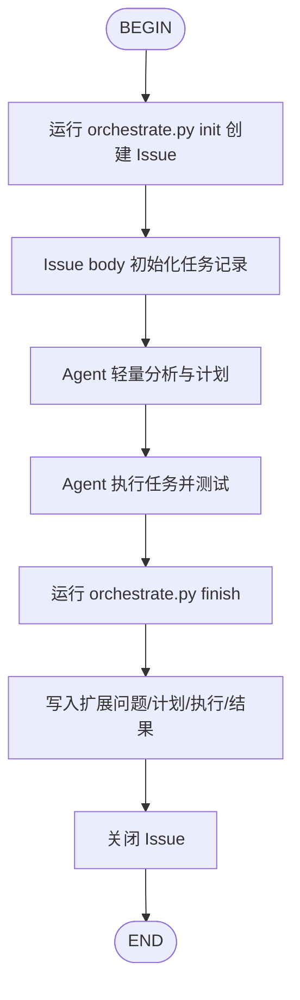

# Git Workflow

基于 [github-cli-skill](../github-cli-skill/SKILL.md) 构建的 Issue 管理工作流。

## 选择规则

- 用户明确要求 GitHub Issue、团队协作追踪、Issue 生命周期、或任务必须同步到 GitHub 时，使用本 Skill。
- 用户要求本地、离线、不使用 GitHub、仅写本地 tracing 时，使用 `local-workflow`。
- 如果用户只是说“执行任务”但没有说明是否要 GitHub Issue，先判断仓库是否有 GitHub remote 和 `gh auth status`；条件不满足时不要强行创建 Issue。
- 不要为纯命令查询触发本 Skill；只需要 `gh` 命令速查时使用 `github-cli`。

## 推荐控制方式：No-Hook

默认不依赖 hook。对 Codex、OpenCode、Trae、Kimi 等 agent，优先通过 `AGENTS.md`、Skill 描述和显式 CLI 控制流程：

1. 用户提出需要 GitHub Issue 追踪的任务。
2. Agent 根据本 Skill 触发，主动运行 `orchestrate.py init`。
3. Agent 执行计划、实现、测试。
4. Agent 主动运行 `orchestrate.py finish` 写回 Issue body 并关闭 Issue。

Hook 只作为可选增强：Claude Code 的 `UserPromptSubmit` hook 可提醒使用本 Skill；Git hooks 只在 commit 时追加 `Refs` 或事件日志；Kimi hooks 只在支持该 hook 系统的环境中自动创建或补充记录。没有安装 hook 时，本 Skill 仍然可完整运行。

## 工作流步骤



### 步骤说明

1. **INIT** — 创建 Issue
   - 运行：`python3 .agents/skills/git-workflow/scripts/orchestrate.py init --title "标题" --description "任务描述"`
   - 创建 GitHub Issue
   - 将任务描述写入 Issue body，并初始化 `Agent Expansion`、`Plan`、`Execution`、`Result` 等待补全区块
   - 保存工作流状态到 `.git-workflow.state.json`
   - 同时创建本地 tracing 记录：`tasks/tracing/<sanitized-task-title>/issue-{number}.md`

2. **PLAN** — Agent 轻量分析
   - 小任务也需要短计划：明确问题、假设、验收标准、最小实现步骤
   - 如果存在用户未说明但会影响实现的点，写入 `Agent Expansion`

3. **IMPLEMENT** — Agent 执行任务
   - 根据任务描述执行代码修改
   - 运行测试并修复问题

4. **FINISH** — 更新 Issue body 并关闭 Issue
   - 运行：`python3 .agents/skills/git-workflow/scripts/orchestrate.py finish --message "完成总结"`
   - 可附加 `--agent-expansion`、`--plan`、`--execution`，把 Agent 扩展问题、计划和执行过程写入 Issue body
   - 关闭 Issue
   - 清理状态文件

## Issue Body 主记录

`git-workflow` 不再在创建 Issue 时写入重复评论。Issue body 是唯一的主记录，完成后包含：

| 区块 | 内容 |
|------|------|
| `Task` | 原始任务描述 |
| `Agent Expansion` | Agent 补充的问题、假设、验收标准、范围澄清 |
| `Plan` | 轻量计划或执行 loop 摘要 |
| `Execution` | 变更范围、测试、检查、文档建议 |
| `Result` | 完成总结 |
| `Metadata` | 创建/完成时间、状态 |

## 本地追踪记录

除了 GitHub Issue body 主记录外，`git-workflow` 还在本地 `tasks/tracing/` 目录维护一份追踪文件：

- **目录结构**：`tasks/tracing/<sanitized-task-title>/issue-{number}.md`
- `<sanitized-task-title>`：Issue 标题经过清理后的目录名（保留字母、数字、连字符，小写，最长 50 字符）
- 该文件与 Issue body 同步，包含任务描述、Agent 扩展、计划、执行和结果摘要

## 前置要求

需要安装 GitHub CLI 并登录：

```bash
# macOS
brew install gh

# Linux
# 参见 https://github.com/cli/cli#installation

# 登录
gh auth login
```

## 脚本说明

### 创建 Issue

```bash
python3 .agents/skills/git-workflow/scripts/create_issue.py \
  --title "实现登录功能" \
  --description "需要实现用户登录功能，包括..." \
  --labels "task,enhancement"
```

| 参数 | 说明 |
|------|------|
| `--title` | Issue 标题（必填） |
| `--description` | 任务描述，会写入 Issue body 的 `Task` 区块（必填） |
| `--labels` | 逗号分隔的标签，默认 `task` |
| `--repo` | 手动指定仓库 `owner/repo`，不填则自动检测 |
| `--remote` | 指定 git remote，默认 `origin` |

### 关闭 Issue（更新 Issue body）

```bash
python3 .agents/skills/git-workflow/scripts/close_issue.py \
  --agent-expansion "验收标准：登录成功返回 token；错误密码返回 401。" \
  --plan "1. 添加认证逻辑。2. 添加测试。3. 运行回归检查。" \
  --execution "修改 src/auth.py，新增 tests/test_auth.py；pytest 通过。" \
  --message "已完成登录功能实现。"
```

| 参数 | 说明 |
|------|------|
| `--message` | 写入 `Result` 的完成总结（必填） |
| `--agent-expansion` | 写入 `Agent Expansion` 的范围澄清、扩展问题、假设、验收标准 |
| `--plan` | 写入 `Plan` 的计划或执行 loop 摘要 |
| `--execution` | 写入 `Execution` 的变更范围、测试、检查 |
| `--issue` | Issue 编号（覆盖状态文件） |
| `--repo` | 仓库（覆盖状态文件） |

**重要**：完成阶段会更新 Issue body，并将 Issue 关闭；不会再创建“首条任务评论”。

### 编排器

```bash
# 初始化工作流
python3 .agents/skills/git-workflow/scripts/orchestrate.py init \
  --title "任务标题" \
  --description "任务描述"

# 查看状态
python3 .agents/skills/git-workflow/scripts/orchestrate.py status

# 完成工作流
python3 .agents/skills/git-workflow/scripts/orchestrate.py finish \
  --agent-expansion "验收标准和关键假设" \
  --plan "轻量计划" \
  --execution "执行过程和测试结果" \
  --message "任务已完成。测试通过。"

# 中止工作流（不关闭 Issue）
python3 .agents/skills/git-workflow/scripts/orchestrate.py abort
```

## 快速参考

| 操作 | 命令 |
|------|------|
| 创建工作流 | `python3 .agents/skills/git-workflow/scripts/orchestrate.py init --title "..." --description "..."` |
| 完成工作流 | `python3 .agents/skills/git-workflow/scripts/orchestrate.py finish --message "..." --agent-expansion "..." --plan "..." --execution "..."` |
| 查看状态 | `python3 .agents/skills/git-workflow/scripts/orchestrate.py status` |
| 中止工作流 | `python3 .agents/skills/git-workflow/scripts/orchestrate.py abort` |

## 安装

Prefer installing with `skill-spark`:

```bash
./dist/skill-spark add skills/devops --skill git-workflow --agent codex claude-code opencode trae kimi --yes
```

The bundled install scripts are legacy fallbacks for environments that do not use `skill-spark`:

```bash
./scripts/install.sh --system
.\scripts\install.ps1 -System
```

## Git Hooks

git-workflow 提供两个 Git Hook，用于自动关联提交和 Issue：

这些 hook 产生的 Issue comments 属于可选事件日志；`init`/`finish` 主流程仍然只把完整任务记录维护在 Issue body 中。

### prepare-commit-msg

当分支名以 Issue 编号开头时（如 `42-feature-login`），自动在提交信息末尾追加 `Refs: #42`。

```bash
# 安装
cp git-workflow/hooks/prepare-commit-msg .git/hooks/
chmod +x .git/hooks/prepare-commit-msg
```

### post-commit

每次提交后自动在关联的 GitHub Issue 下添加评论，记录提交 hash、消息和分支。

```bash
# 安装
cp git-workflow/hooks/post-commit .git/hooks/
chmod +x .git/hooks/post-commit
```

## Kimi Hooks

Kimi（包括 kimi-cli）完全支持本 Skill。通过 `~/.kimi/config.toml` 配置 hooks 可实现自动 Issue 创建和会话结束更新。

### kimi-auto-issue.sh (PostToolUse)

当在 `tasks/` 目录下写入 `.md` 文件时，自动创建 GitHub Issue。

```bash
# 在 ~/.kimi/config.toml 中配置
[[hooks]]
event = "PostToolUse"
command = "/path/to/git-workflow/hooks/kimi-auto-issue.sh"
```

### kimi-stop-update.sh (Stop)

当 Kimi 会话结束时，自动在活跃的 Issue 下添加一条可选事件日志评论；主任务记录仍然在 Issue body。

```bash
# 在 ~/.kimi/config.toml 中配置
[[hooks]]
event = "Stop"
command = "/path/to/git-workflow/hooks/kimi-stop-update.sh"
```

## Claude Code 集成

### 自动触发 Hook

安装 `claude-auto-issue.sh` 到项目级 `.claude/settings.json`：

```json
{
  "hooks": {
    "UserPromptSubmit": [
      {
        "matcher": "*",
        "hooks": [
          {
            "type": "command",
            "command": "bash .agents/skills/git-workflow/hooks/claude-auto-issue.sh",
            "timeout": 10
          }
        ]
      }
    ]
  }
}
```

Hook 会检测任务执行相关的 prompt（如"执行任务"、"execute task"、"Task 9"等），并自动注入上下文提醒 Agent 使用 git-workflow。

### CLAUDE.md 指令

在项目根目录的 `CLAUDE.md` 中添加 git-workflow 指令，确保 Claude Code 在每次会话加载时都能看到任务执行必须走 git-workflow 的规则。

## 相关文档

| 文档 | 说明 |
|------|------|
| [references/workflow.md](references/workflow.md) | 工作流详细参考 |
| [references/simple-workflow-runtime.md](references/simple-workflow-runtime.md) | 参考 Yorun 的最小 workflow skill set 方案 |
